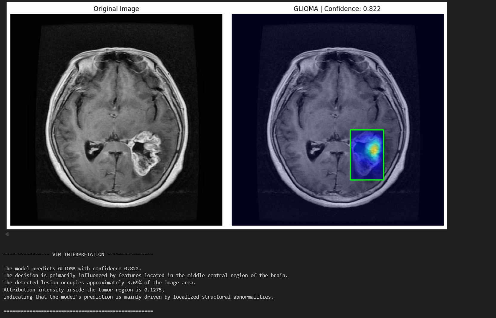
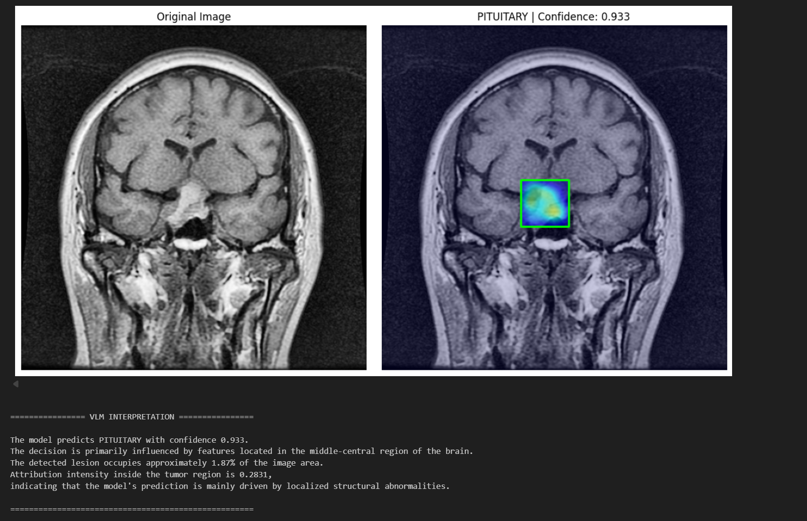
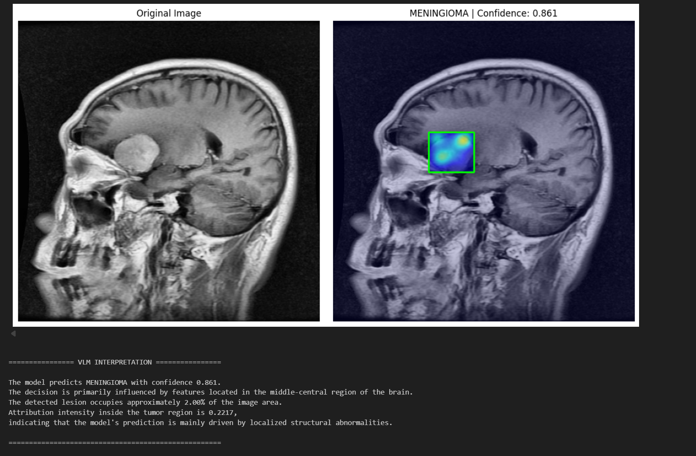
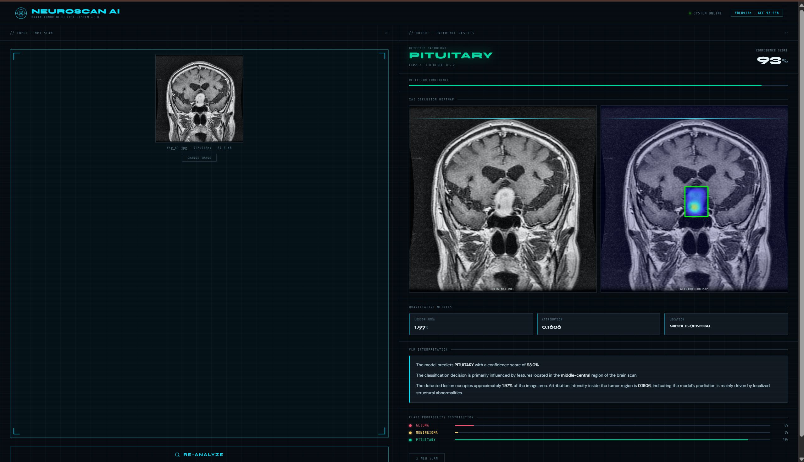

# Brain Tumor Detection using YOLOv12n

This project focuses on detecting brain tumors from MRI images using the YOLOv12n object detection model. The system integrates advanced image preprocessing techniques to enhance tumor visibility and improve detection performance.

The project also generates interpretable visual outputs that resemble explainable AI (XAI) and vision-language model (VLM) style interpretations.

---

## Project Overview

Brain tumors are one of the most critical neurological conditions, and early detection is essential for effective treatment. This project applies deep learning-based object detection to identify tumor regions in MRI scans.

The workflow includes preprocessing MRI images, training a YOLOv12n model, and generating detection outputs that highlight tumor regions.

---

## Key Features

- Brain tumor detection using **YOLOv12n**
- MRI preprocessing to enhance tumor visibility
- Integration of two medical imaging datasets
- Visual outputs resembling **explainable AI interpretations**
- Automated tumor localization using bounding boxes

---

## Datasets Used

### BraTS 2020 Dataset
The Brain Tumor Segmentation (BraTS) dataset provides multimodal MRI scans including tumor annotations.

Dataset link:
https://www.kaggle.com/datasets/awsaf49/brats20-dataset-training-validation

### Figshare Brain Tumor Dataset
This dataset contains MRI images labeled for different types of brain tumors.

Dataset link:
https://www.kaggle.com/datasets/ashkhagan/figshare-brain-tumor-dataset

---

## Image Preprocessing Techniques

To improve tumor visibility and model performance, the following preprocessing techniques were applied:

### Log Transformation
Enhances low-intensity regions in MRI scans and improves contrast for subtle tumor regions.

### Histogram Equalization
Redistributes intensity values to improve global contrast in MRI images.

### CLAHE (Contrast Limited Adaptive Histogram Equalization)
Enhances local contrast and prevents over-amplification of noise.

These preprocessing steps significantly improve the clarity of tumor regions before detection.

---

## Model

The detection model used is **YOLOv12n**, a lightweight object detection architecture designed for fast inference and efficient performance.

The model was trained on MRI brain tumor datasets including **BraTS2020** and **Figshare Brain Tumor Dataset**.

Preprocessing techniques applied before training include:

- Log transformation
- Histogram equalization
- CLAHE (Contrast Limited Adaptive Histogram Equalization)

These techniques improve MRI contrast and help highlight tumor regions.

---

## Detection Results

Example tumor detection outputs from MRI scans.





## Web Interface

The project includes a Flask-based web dashboard that allows users to upload MRI brain scans and automatically detect brain tumors using the YOLOv12n model.

### Features
- Upload MRI scan
- Automatic tumor detection
- Bounding box visualization
- Explainable AI heatmap
- Detection confidence and tumor type

### Dashboard Preview



---

## Model Performance

The YOLOv12n model was trained to detect three types of brain tumors from MRI images.

| Class | Precision | Recall | mAP@0.5 | mAP@0.5:0.95 |
|------|------|------|------|------|
| Glioma | 0.869 | 0.726 | 0.819 | 0.535 |
| Meningioma | 0.948 | 0.979 | 0.992 | 0.778 |
| Pituitary | 0.946 | 0.936 | 0.979 | 0.658 |
| **Overall** | **0.921** | **0.881** | **0.93** | **0.657** |

### Model Details
- Model: **YOLOv12n**
- Total Parameters: **2,557,313**
- Layers: **159**
- GFLOPs: **6.3**
- Dataset Size: **668 MRI images**

### Inference Performance
- Preprocessing time: **0.2 ms**
- Inference time: **2.6 ms**
- Postprocessing time: **1.3 ms**

---


  
## Project Workflow

1. Load MRI datasets (BraTS2020 and Figshare)
2. Apply preprocessing techniques:
   - Log Transform
   - Histogram Equalization
   - CLAHE
3. Convert annotations to YOLO format
4. Train YOLOv12n detection model
5. Perform tumor detection on MRI images
6. Generate detection visualizations
7. Produce interpretable visual outputs similar to XAI/VLM explanations

---

## Technologies Used

- Python
- PyTorch
- Ultralytics YOLO
- OpenCV
- NumPy
- Matplotlib
- Scikit-image

---

## Installation

Clone the repository:

```bash
git clone https://github.com/yourusername/brain-tumor-detection-yolov12.git
cd brain-tumor-detection-yolov12
